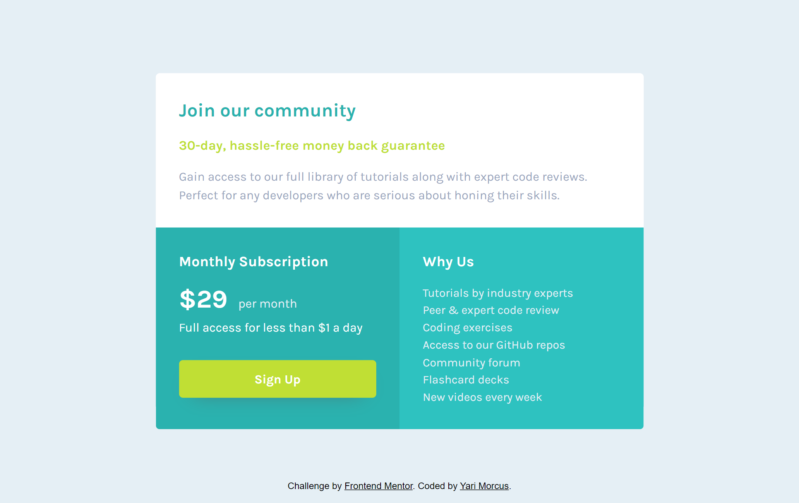

# Frontend Mentor - Single price grid component

This is a solution to the [single price grid component challenge on Frontend Mentor](https://www.frontendmentor.io/challenges/single-price-grid-component-5ce41129d0ff452fec5abbbc). Frontend Mentor challenges help you improve your coding skills by building realistic projects.

### Difficulty: `newbie`

## Table of contents

- [Overview](#overview)
  - [The challenge](#the-challenge)
  - [Links](#links)
- [My process](#my-process)
  - [Built with](#built-with)
  - [What I learned](#what-i-learned)
  - [Continued development](#continued-development)
  - [Useful resources](#useful-resources)
- [Author](#author)

## Overview

### The challenge

To build the single price grid component according to the given designs as close as possible.
The users should be able to:
- View the optimal layout for the component depending on their device's screen size
- See a hover state on desktop for the Sign Up call-to-action

### Links

- Solution URL: [Open GitHub repository](https://github.com/YariMorcus/single-price-grid-component)
- Live Site URL: [open GitHub Pages of repository](https://yarimorcus.github.io/single-price-grid-component)

## My process

### Built with

- Semantic HTML5 markup
- CSS _(BEM naming convention used, [see getbem.com](http://getbem.com) for more information)_
- Grid
- Mobile-first workflow
- Optimized for both Open Graph (Facebook) and Twitter Cards
- [Node.js](https://nextjs.org/) - Open source and multiplatform JavaScript runtime environment
- [NPM](https://www.npmjs.com/) - Package Manager for Node JavaScript platform
- [Browsersync](https://browsersync.io) - Synchronous browser testing (in collaboration with Gulp)
- [Gulp](https://gulpjs.com) - Build tool used as workflow automation tool
- [Sass](https://sass-lang.com/) - CSS Preprocessor (in collaboration with Gulp)
- [GitHub](https://github.com/) - Technological platform based on Git
- [Git](https://git-scm.com/) - Free and open source distributed version control system

### What I learned

1. Always use semantic compliants-standard HTML
2. To keep testing the application for Web Accessibility
3. To spend time looking at the details of the designs, to create the application as close as possible to it
4. How to organize my SCSS with Sass partials and modules, and keep my SCSS organized
5. How to implement Open Graph (Facebook) and Twitter Cards

### Continued development

The way I want to continue to develop myself is by focusing on laying out a proper foundation of HTML, CSS, and JavaScript.
This so I can build quality websites for clients by just using the core languages of the Web.
At the present, I am working on the above things by going through (interactive) articles on the MDN Web Docs (see chapter [Useful resources](#useful-resources)).

Another way I want to improve my knowledge of these subjects is to do more challenges that [Frontend Mentor](https://www.frontendmentor.io/challenges) is offering, starting at the lowest level, and building that up to the more advanced ones.

Besides the above, I want to continue to develop myself by using several tools more often to improve my workflow. and spend less time doing things that can be automated.

A few tools that I will start using more often are:
1. Gulp
2. Git
3. GitHub

_I will learn the above points in between but do not want to focus too much on those at the moment._

As soon as I am capable of creating quality websites with the core languages of the Web, I will start to learn JavaScript libraries and frameworks. Both of these change over time, so I do not want to spend my time on those before I have a solid understanding of prior mentioned languages.

### Useful resources

- [Transfonter](https://transfonter.org) - Has been used to convert the downloaded font files to woff and woff2 (most recent font formats, supported in all major browsers), and generate the corresponding `@font-face` css rulesets
- [Single price grid component challenge on Frontend Mentor](https://www.frontendmentor.io/challenges/single-price-grid-component-5ce41129d0ff452fec5abbbc)

## Author

- LinkedIn - [Yari Morcus](https://www.linkedin.com/in/yarimorcus)
- Frontend Mentor - [@YariMorcus](https://www.frontendmentor.io/profile/YariMorcus)